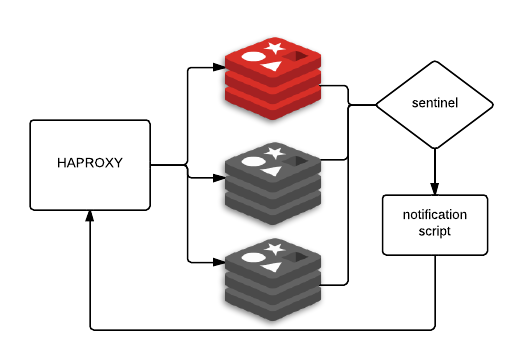

# Redis HA - sentinel + haproxy

- sentinel: autoswitch master/slave
- haproxy: active check for only master node
- haproxy api: disable failed nodes to prevent multimaster



without haproxy maintenance mode
```
  A is master, B is slave
  A crashes, sentinel convert B to master
  A is recovered (still master)
  haproxy balancing between A and B, until sentinel convert A to slave
  data written to A are lost
```

witch haproxy maintenance mode via notification script
```
  A is master, B is slave
  A crashes, sentinel convert B to master
  haproxy disable A
  A is recovered (still master) but disabled in haproxy
  haproxy points only to B
```

### Run redis cluster
```
redis-server --port 6666
redis-server --port 6667
redis-server --port 6668
```

### Set slaves
```
redis-cli -p 6667 SLAVEOF 127.0.0.1 6666
redis-cli -p 6668 SLAVEOF 127.0.0.1 6666
```

### Run sentinel
```
redis-server sentinel.conf  --sentinel
```

### Run haproxy
```
haproxy -f haproxy.cfg -db
```

Open http://localhost:8080/ and try kill some redis


### Notice
tested on
- redis 2.8.6
- haproxy 1.5-dev21

[!] in production on single host you must specify different data dir before SLAVEOF command otherwise you loose data on master
